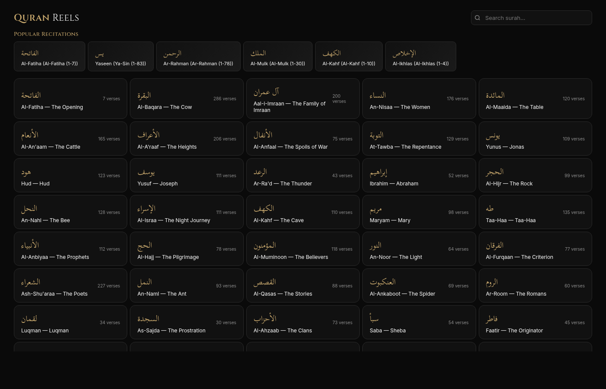

# Quran Reels Studio Pro 🎬

Generate TikTok/Reels-style Quran recitation videos in your browser. Pick a surah, select verses, choose from 65+ reciters, customize visuals, and export as `.webm` — fully client-side, no server.

**Live:** https://quran-reels-lyart.vercel.app

## What's New (v2)

- **65+ reciter variants** — all verified on everyayah.com
- **25 gradient presets** with animated stars on dark themes
- **216 video backgrounds** — Pixabay CDN + live **Pexels search** with thumbnail capture, vignette, parallax and color overlay (v1.1)
- **12 Arabic fonts** — Scheherazade New, Amiri, Tajawal, Cairo, Almarai, Reem Kufi, Katibeh, Lateef, Ruwudu, Alexandria + more
- **10 English fonts** — Inter, Cinzel, Playfair Display, Montserrat, Poppins, DM Sans, Space Grotesk, Outfit, Quicksand + more
- **Smooth TikTok-style transitions** — crossfade, zoom, slide with configurable duration
- **Full editing suite** — text position, line height, shadow, stroke, watermark position, blur, background speed
- **Custom upload** your own images/videos as background
- **Cancel button** during export
- **Font weight control** for both Arabic and English
- **Export FPS** — 24/30/60fps
- **Mobile responsive** — works on phone browsers

## Usage

1. **Pick a surah** from the grid or search by name
2. **Select verses** — tap individual verses or Select All
3. **Enter Studio** — choose reciter, background, fonts, colors, effects
4. **Preview** to check sound and visuals
5. **Export MP4** — real-time render with smooth verse transitions

## Tech

- Single HTML file (no build, no framework)
- Canvas API + requestAnimationFrame for rendering
- MediaRecorder + AudioContext for export with crossfade
- everyayah.com for per-verse MP3 audio
- alquran.cloud for Arabic + English text
- Pixabay CDN for video backgrounds

## Deploy

Push to main branch on GitHub — Vercel auto-deploys.
